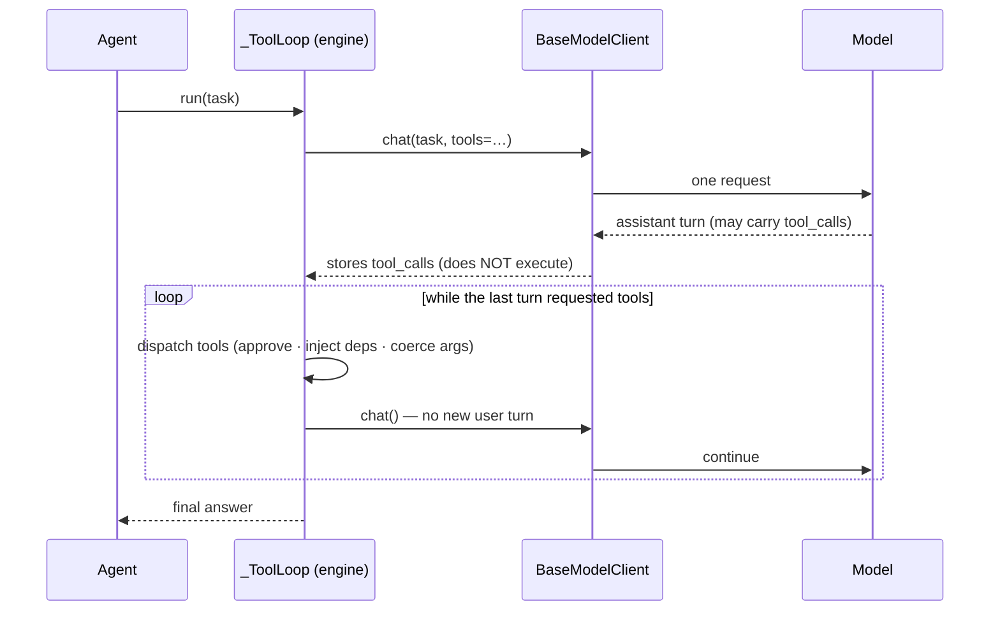
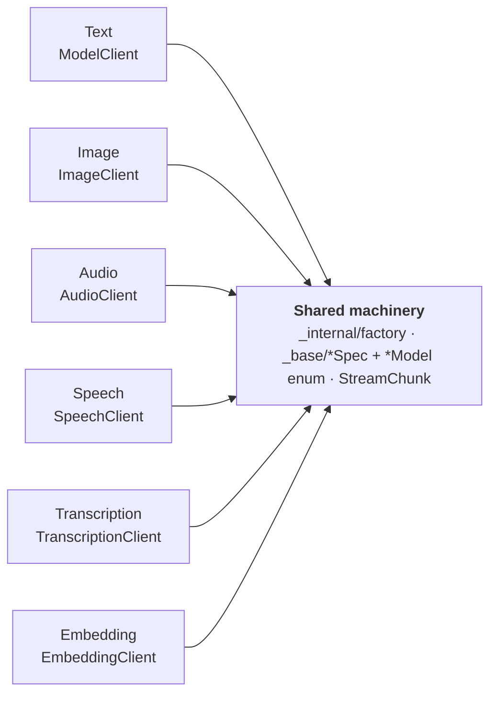

# Architecture

The whole library fits in your head because it is a small set of **uniform interfaces** plus
factories that build them and adapters that let them stand in for one another. Learn the interface
once and every provider, modality, agent, and workflow behaves the same way:

| Interface | One per… | Concretes |
|---|---|---|
| `BaseModelClient` | text provider | Ollama, Anthropic, OpenAI-compat, HuggingFace, llama.cpp |
| `Base{Image,Audio,Speech,Transcription,Embedding}Client` | other modality | HF, OpenAI, Gemini, Ollama (per modality) |
| `Runner` | agent or workflow | `Agent`, `SkillAgent`, `OrchestratorAgent`, `Chain`, `Router`, `Parallel`, … |
| `StreamChunk` | streaming source | every `chat()` / `run()` / image-gen stream |
| `MemoryStore` | memory backend | `SemanticMemoryStore`, `DocumentStore` |
| `Channel` | chat transport (async) | `CLIChannel`, `WebChannel` |

There is no `Message` class, no `Runnable` protocol, no graph DSL. Conversation state is a plain
`list[dict]` in OpenAI format. Everything below is a consequence of keeping these interfaces small
and composable — see [Design principles](design-principles.md).

## The big picture

A request flows top-down: the ergonomic top-level API resolves a model and hands off to either a
plain client (one turn) or a `Runner` that drives the model over multiple turns. Tool *execution*
lives in an internal engine between the `Runner` and the client, never in the client itself.

```mermaid
flowchart TB
  E["<b>Top-level API</b> — aimu.chat · client · agent · image_client · embed · transcribe · …"]
  AG["<b>Runner layer</b> (aimu.agents) — Agent · SkillAgent · OrchestratorAgent<br/>Chain · Router · Parallel · EvaluatorOptimizer · PlanExecuteEvaluator"]
  TL["<b>_ToolLoop / _AsyncToolLoop</b> — internal engine: dispatch · approve · inject deps · loop"]
  F["<b>ModelClient</b> (factory)"]
  B["<b>BaseModelClient</b> — chat() = one model turn (parse + store, no execution)"]
  P["<b>Providers</b> — Ollama · Anthropic · OpenAI-compat · HuggingFace · llama.cpp"]
  E --> F --> B --> P
  E --> AG
  AG -->|composes per run| TL
  TL -->|chat(tools=…), dispatch, repeat| B
```

The three most load-bearing ideas — the single-turn client, the tool-loop engine, and the `Runner`
interface — each get a section below.

## A tool-using turn: three layers

Tool calling is split into three layers with one responsibility each. This is the part most worth
understanding, because it is where the "the client is a pure adapter" principle pays off.

1. **Model client — a pure provider adapter.** `chat()` is a **single model turn**: it advertises
   the `tools=` it was handed, issues one request, and when the model asks for a tool it calls
   `self._record_tool_calls(...)` to *parse and store* the call on the assistant message. It does
   **not** execute tools and keeps **no** persistent tool registry, approval policy, or deps.
2. **Tool-loop engine — the internal middle layer** (`_ToolLoop` / `_AsyncToolLoop`, in
   `aimu.agents._tool_loop` / `aimu.aio._tool_loop`). It owns the *iterative tool-calling logic*:
   dispatch the pending calls (one by-name lookup), enforce the approval policy, inject
   `ToolContext(deps)`, coerce arguments, run them (concurrently when `concurrent_tool_calls`),
   append the `role:"tool"` results, and call the client again — repeating until a turn makes no
   tool calls (bounded by `max_rounds`), then the optional `final_answer_prompt` wrap-up. It is
   **not** public API; the ladder stays `chat()` → `Agent` → workflows.
3. **`Agent` — autonomy and composition.** It holds the tool configuration (`tools`, `deps`,
   `tool_approval`, `concurrent_tool_calls`) plus per-run `run(tools=/deps=/tool_approval=)`
   overrides, composes a `_ToolLoop` per run (`_make_tool_loop`), and adds identity, the `Runner`
   interface, `restore()`, and the `schema=` short-circuit.



The consequence: a bare `client.chat("q", tools=[...])` parses and stores the tool call but never
runs it. To *execute* tools you need an `Agent` (or `agent.as_model_client()`). See
[Tool integration](tool-integration.md) for the `@tool` / MCP routes and dispatch details.

## The base contract: `BaseModelClient`

Every text provider speaks the same shape:

```python
class BaseModelClient(ABC):
    model: Model
    messages: list[dict]          # OpenAI format; the source of truth
    system_message: str | None
    tools: list[Callable]         # per-call transient (default []); pass via chat(..., tools=...)
    last_thinking: str
    last_usage: dict | None
    last_structured: object | None

    def chat(user_message=None, *, tools=None, stream=False, images=None, audio=None,
             schema=None, include=None, ...) -> str | Iterator[StreamChunk] | <schema instance>
    def generate(prompt, *, images=None, audio=None, schema=None, ...) -> ...
    def reset(system_message="__keep__") -> None
```

`chat()` and `generate()` are **concrete** on the base — they apply the `include=` stream filter and
the `schema=` structured-output path, then delegate to abstract `_chat()` / `_generate()` which each
provider implements. A cross-cutting feature (streaming filters, structured output, vision/audio
input normalization) lands in one place and works everywhere. The I/O-free helpers — the
`system_message` lifecycle, `reset()`, tool-spec collection, tool-call recording
(`_record_tool_calls`), and structured-request resolution (`_structured_request`) — live in the
shared `_ChatStateMixin` ([`_internal/chat_state.py`](../reference/api/models.md)), inherited by
both the sync and async bases.

Providers that need a different wire format (Anthropic blocks, Ollama image fields, HF PIL images)
adapt at request time and never mutate `self.messages`. See
[System message lifecycle](system-message-lifecycle.md) and
[Thinking and context](thinking-and-context.md) for how history and reasoning are managed.

## The factory: `ModelClient`, `ModelSpec`, `Model`

```python
ModelClient(OllamaModel.QWEN_3_8B)      # provider from the enum type
ModelClient("anthropic:claude-sonnet-4-6")  # or from a "provider:model_id" string
```

`ModelClient` is the single public entry point. It resolves the `Model` enum (or string) against a
provider registry, instantiates the matching concrete client, and delegates every method to it,
keeping your code provider-agnostic. Provider classes (`OllamaClient`, `AnthropicClient`, …) remain
importable but are not the recommended surface.

Each provider lists its models as a `Model` enum whose members carry a `ModelSpec` — a frozen
dataclass of the id string plus capability flags (`tools`, `thinking`, `vision`, `audio`,
`structured_output`, optional `generation_kwargs`). Equality/hash use the id only, so a spec can
hold a dict and still be an enum value. Members expose `.value` (the id), `.spec`, mirrored
`.supports_*` flags, and derived `TOOL_MODELS` / `THINKING_MODELS` / `VISION_MODELS` classproperties.
This same spec-plus-enum-plus-factory pattern recurs for every modality below.

## Modality surfaces: one shape, six stacks

Text is one of six parallel modality surfaces. Each is an independent stack with the *same shape*,
built on the shared `_base/` spec/enum types and the `_internal/factory.py` machinery:

| Modality | Base ABC | Factory | Top-level entry points |
|---|---|---|---|
| Text (chat) | `BaseModelClient` | `ModelClient` | `aimu.client()` / `aimu.chat()` |
| Image | `BaseImageClient` | `ImageClient` | `aimu.image_client()` / `aimu.generate_image()` |
| Audio (music/sound) | `BaseAudioClient` | `AudioClient` | `aimu.audio_client()` / `aimu.generate_audio()` |
| Speech (TTS) | `BaseSpeechClient` | `SpeechClient` | `aimu.speech_client()` / `aimu.generate_speech()` |
| Transcription (STT) | `BaseTranscriptionClient` | `TranscriptionClient` | `aimu.transcription_client()` / `aimu.transcribe()` |
| Embedding | `BaseEmbeddingClient` | `EmbeddingClient` | `aimu.embedding_client()` / `aimu.embed()` |



The non-text base ABCs do **not** subclass `BaseModelClient` — the contracts are disjoint. `chat()`,
`messages`, `system_message`, `tools`, and the chat `StreamChunk` phases are meaningless for
stateless text-to-image or text-to-vector. Forcing the modalities into one class would bleed
irrelevant fields into every user's code. What they share is *shape*, not implementation: the same
factory-plus-concretes pattern, the same `provider:id` string format, and the same per-provider
extras (`[hf]` covers HF across modalities; `[google]` is image-only since text-side Gemini uses the
OpenAI-compat endpoint).

Modalities meet in practice through **tools**: the built-in `generate_image` / `generate_audio` /
`transcribe_audio` tools wrap a modality client so any text agent can reach it, and
`SemanticMemoryStore` takes an `EmbeddingClient`. The agent loop never knows whether a tool hits a
cloud API or a local GPU.

## Agents and workflows: `Runner`

`Runner(ABC)` is the common interface for anything you can `run()`:

```python
class Runner(ABC):
    def run(task, *, generate_kwargs=None, stream=False, images=None) -> str | Iterator[StreamChunk]: ...
    @property
    def messages(self) -> dict[str, list[dict]]: ...
    def as_tool(self, *, name=None, description=None) -> Callable: ...   # concrete
```

There is a single `Runner` ABC. The autonomous-vs-code-controlled split survives as a
*categorisation of concrete classes*, not a type hierarchy:

- **Autonomous** (the LLM directs flow): `Agent` loops until the model stops calling tools;
  `SkillAgent` adds filesystem-discovered skills; `OrchestratorAgent` wraps worker runners as tools
  (its `assemble()` factory + the prebuilt `ResearchReportAgent` / `CodeReviewAgent` /
  `ContentCreationAgent`).
- **Code-controlled** (Python directs flow): `Chain` (steps in order), `Router` (classify then
  dispatch), `Parallel` (fan out, optional aggregate), `EvaluatorOptimizer` (generate→critique→
  revise), `PlanExecuteEvaluator` (plan→execute-with-tools→score→replan).

All concretes are exported from `aimu.agents`. This is the *Building Effective Agents* taxonomy made
concrete — see [Agents vs workflows](agents-vs-workflows.md).

## Composition seams

Because everything speaks a uniform interface, the pieces substitute for one another through a
handful of adapters. This is where "composability through uniform interfaces" cashes out:

| Adapter | Turns… | …into a | So you can |
|---|---|---|---|
| `Runner.as_tool()` | any agent/workflow | `@tool` callable | let an `Agent` call a `Chain`; give an orchestrator workers |
| `agent.as_model_client()` | an `Agent` | `BaseModelClient` | drop an agent into `Benchmark`, a `Chain` step, or any client slot |
| `FallbackClient` | an ordered client list | one `BaseModelClient` | fail over across providers with no special wiring |
| `MCPClient.as_tools()` | a remote MCP server's tools | local callables | mix cross-process tools with `@tool` functions |
| `RemoteAgent` (A2A) | a remote agent over HTTP | a local `Runner` | compose a remote agent as a tool / worker / step |

`RemoteAgent` is the agent-level analog of `MCPClient`: MCP shares *tools* over the wire, A2A shares
whole *agents*. Both are optional adapters at the boundary, not core abstractions — see
[A2A vs MCP](a2a-vs-mcp.md).

## Resilience and structured output

Two features compose *over* `BaseModelClient` rather than adding class trees:

- **`FallbackClient`** wraps an ordered list of clients and fails over on error, preserving
  conversation state across the switch; when all fail it raises `FallbackExhaustedError` (with
  `.errors`). Because it *is* a `BaseModelClient`, it drops into agents, workflows, and `Benchmark`
  unchanged. Pair it with per-client `timeout` / `max_retries` (forwarded verbatim to the SDK) for
  in-SDK retry plus cross-provider failover.
- **Structured output** (`schema=` on `chat()`/`generate()`, and `Agent.run(schema=...)`) returns a
  validated dataclass / Pydantic instance. The base branches on the model's `supports_structured_output`
  flag: native provider enforcement (`response_format`, Ollama `format=`, or an Anthropic forced
  tool) when available, otherwise a JSON-Schema instruction + parse. The result is also stored on
  `client.last_structured`. It streams too (a terminal `DONE` chunk carries the object).

## Two surfaces, one shape (sync and async)

Everything above is the **sync** surface. AIMU ships an opt-in **async** surface under `aimu.aio`
that mirrors it one-for-one — same class names, same `Runner` decision tree, same `StreamChunk`.

```
aimu.{chat, client, Agent, Chain, …}        # sync (default)
aimu.aio.{chat, client, Agent, Chain, …}    # async (opt-in)
```

The two surfaces **share** the state mechanics and pure logic rather than duplicating them:
`_ChatStateMixin`, the `_base/*` spec/enum types, the `_internal/*` helpers (streaming, JSON,
structured, usage, image/audio I/O), the `_AgentLoopMixin`, `_FallbackStateMixin`, the tool-loop's
`async`-free construction and helpers (`_BaseToolLoop`, subclassed by both `_ToolLoop` and
`_AsyncToolLoop`), the in-process wrapper mechanics (`_AsyncInProcessClient`, subclassed by
`AsyncHuggingFaceClient` / `AsyncLlamaCppClient`), and even the loop's stop condition
`last_turn_called_tools`. What is **duplicated by necessity** is only the `await` points: the
`_chat`/`_generate` bodies, the `_ToolLoop` vs `_AsyncToolLoop` loop drivers and dispatch, the
concurrency primitive (`asyncio.TaskGroup` vs `ThreadPoolExecutor`), and the streaming return type
(`AsyncIterator[StreamChunk]` vs `Iterator[StreamChunk]` — a deliberate asymmetry).

The async surface also carries a few **async-only** primitives for always-on assistants: the
`Channel` transport (`CLIChannel`, `WebChannel`), the `Scheduler` for proactive triggers, and
`RunHandle` for cooperative run cancellation. See [Async design](async-design.md).

## Streaming: one chunk type everywhere

`StreamChunk(phase, content, agent=None, iteration=0)` is the single chunk type yielded by every
streaming path — `client.chat()`, `Agent.run()`, every workflow `run()`, image/audio generation,
and streaming tools. Earlier versions had separate `AgentChunk` / `ChainChunk`; both collapsed into
`StreamChunk`. The `agent` and `iteration` fields are populated by agents/workflows and default to
`None` / `0` for plain chats. See [StreamChunk model](streamchunk-model.md) and the
[stream phases reference](../reference/stream-phases.md).

## What lives where

| Package | Role |
|---|---|
| `aimu` | Top-level `chat()`, `client()`, `agent()`, per-modality `*_client()` / `generate_*()` / `embed()` / `transcribe()`, re-exports |
| `aimu.aio` | Async mirror of the sync surface + async-only `channels`, `scheduler`, `run_handle` |
| `aimu.models` | Every modality: `Base*Client` ABCs (`_base/`), factories, `ModelSpec`/`Model` enums, `_internal/` helpers, provider clients, `FallbackClient` |
| `aimu.agents` | `Runner` ABC; `Agent`/`SkillAgent`/`OrchestratorAgent`; workflows; the `_tool_loop` engine; `a2a` interop; `prebuilt/` orchestrators |
| `aimu.tools` | `@tool` decorator, `MCPClient`, `ToolContext` (deps), approval hook, `builtin.*` groups |
| `aimu.skills` | `AgentSkill`, `SkillManager` (discovery), runtime authoring, skills MCP server |
| `aimu.memory` | `MemoryStore` ABC, `SemanticMemoryStore`, `DocumentStore`, MCP servers |
| `aimu.rag` | `ingest` / `retrieve` / `format_context` / `split_text` / `rerank` — plain functions over `MemoryStore` |
| `aimu.sessions` | Multi-user `SessionStore` (`InMemory` / `TinyDB`) keyed by `channel:sender`, `Session`, `SessionLocks` |
| `aimu.history` | `ConversationManager` (single-conversation TinyDB persistence) |
| `aimu.prompts` | Versioned `PromptCatalog`, `PromptTuner` + concrete tuners, `Scorer` |
| `aimu.evals` | `Benchmark` / `BenchmarkResults`, DeepEval adapters |

A few subsystems are newer than the client/agent core and worth calling out:

- **`aimu.sessions`** generalizes the single-conversation `ConversationManager` to many users/chats
  in one process, keyed by `channel:sender`. It reuses the `reset()` + `restore()` per-turn seam so
  agents never share a live `messages` list.
- **`aimu.rag`** is deliberately *functions*, not a `Retriever`/`Splitter` class tree — the retriever
  interface already exists as `MemoryStore.search()`. RAG is a workflow you compose
  (`ingest` → `retrieve` → `format_context` → `chat`), not a new abstraction.
- **`aimu.skills`** discovers `SKILL.md` files and can *author* new skills (and runnable scripts) at
  run time; `SkillAgent` surfaces them through its tool list mid-run.

Each package has its own optional dependency; `aimu[all]` installs everything, and piecewise installs
degrade gracefully via `HAS_*` flags.

## See also

- [Design principles](design-principles.md): what AIMU deliberately doesn't do, and why.
- [Agents vs workflows](agents-vs-workflows.md): the taxonomy and when to pick which.
- [Tool integration](tool-integration.md): the `@tool` and MCP routes, dispatch, and failure modes.
- [StreamChunk model](streamchunk-model.md): why one chunk type.
- [System message lifecycle](system-message-lifecycle.md) · [Thinking and context](thinking-and-context.md).
- [A2A vs MCP](a2a-vs-mcp.md) · [Async design](async-design.md).
- Reference: [provider matrix](../reference/provider-matrix.md) · [model matrix](../reference/model-matrix.md) · [stream phases](../reference/stream-phases.md).
